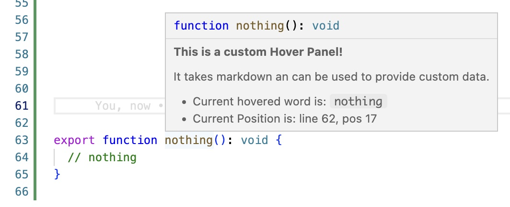
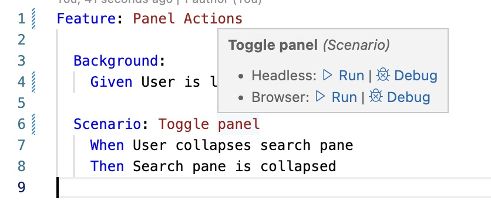

# Custom Hover Extension




This extension provides a bridge to create custom hoverProviders in your project.
The main purpose is to be able to provide an experience 100% tailored to your project.

Use cases include:

- creating custom run command based on hovered context (like running tests for instance)
- displaying metadata for hovered locations
  ...

## Usage

1. Install typings for vscode `npm install @types/vscode`.

2. Put a file `provideHover.mjs` in your project root with the following code:

```js
// provideHover.mjs

// Note: we could also use typescript and actually transpile this file
// here we use type annotations in a plain js module!
/** @typedef{ import('vscode') } vscode */
/** @typedef{ import('vscode').TextDocument } TextDocument */
/** @typedef{ import('vscode').Position } Position */
/** @typedef{ import('vscode').Range } Range */
/** @typedef{ import('vscode').Hover } Hover */
/** @typedef{ import('vscode').CancellationToken } CancellationToken */

/**
 * we can only use ts annotations here unfortunately
 * if you want actual ts you need to compile this file yourself from ts
 * @param vscode {vscode}
 * @param document {TextDocument}
 * @param position {Position}
 * @param token {CancellationToken}
 * @return {Promise<Hover>}
 */
export function provideHover(vscode, document, position, token) {
  // get word from the document at the hovered location
  const range = document.getWordRangeAtPosition(position);
  const word = document.getText(range);

  // generate something to display
  const markdown = new vscode.MarkdownString(
    `
__This is a custom Hover Panel!__

It takes markdown an can be used to provide custom data.

* Current hovered word is: \`\`\`${word}\`\`\`
* Current Position is: line ${position.line}, pos ${position.character}
`,
    true
  );
  markdown.isTrusted = true;
  return new vscode.Hover(markdown);
}
```

3. In case your method returns `undefined`, no hover will be shown.

4. You can use the document url to filter for file types etc..

```js
export function provideHover(vscode, document, position, token) {
  // use this to bail out in case you don't want to provide a hover panel
  const uri = document.uri.toString();
  if (!uri.match(/\.txt$/)) {
    return;
  }
  // ..
}
```

## Extension Settings

This extension contributes the following settings:

- `customhover.provideHoverFile`: path to file which exports `provideHover`method, default `[workspace]/provideHover.mjs`

## Release Notes

### 1.0.0

Initial release of Custom Hover
